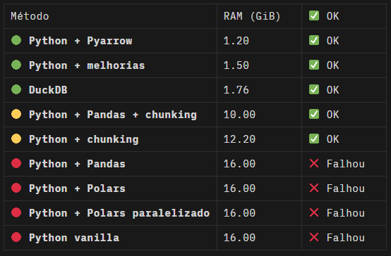
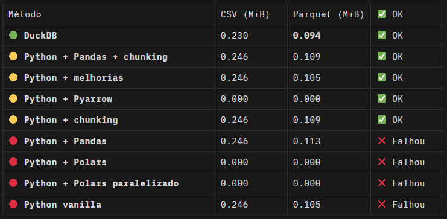
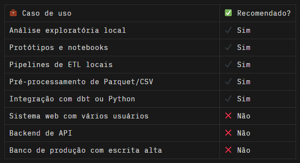
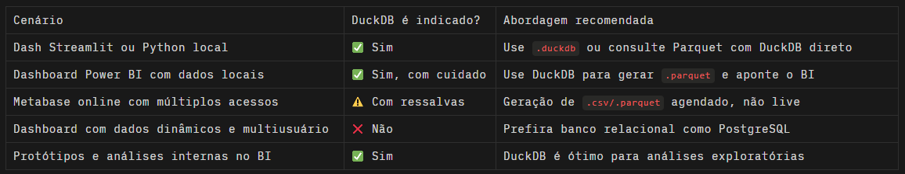
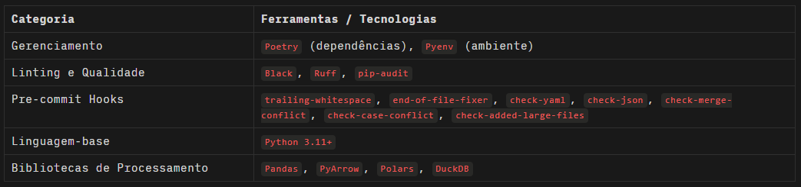

<p align="right">
  <a href="README.md">
     Português
  </a>
</p>

> A Data Engineering project focused on **local ETL, benchmarking, interactive data visualization, and strategic use of DuckDB**, designed as a realistic case study for a professional portfolio.

# ONE BILLION ROWS CHALLENGE – PYTHON EDITION 🐍

## TABLE OF CONTENTS

- [ONE BILLION ROWS CHALLENGE – PYTHON EDITION 🐍](#one-billion-rows-challenge--python-edition-)
  - [TABLE OF CONTENTS](#table-of-contents)
  - [ABOUT THE PROJECT](#about-the-project)
  - [INSPIRATION](#inspiration)
  - [BUSINESS PROBLEM](#business-problem)
  - [PROPOSED CHALLENGE](#proposed-challenge)
    - [GENERAL OPERATION](#general-operation)
    - [OUTPUT FILE](#output-file)
    - [INTERESTING TECHNICAL HIGHLIGHTS](#interesting-technical-highlights)
  - [HOW TO RUN](#how-to-run)
    - [REQUIREMENTS](#requirements)
    - [INSTALLATION AND SETUP](#installation-and-setup)
    - [LOGGING](#logging)
  - [OUTPUT EXAMPLES](#output-examples)
  - [BENCHMARKING AND PERFORMANCE RESULTS ✨](#benchmarking-and-performance-results-)
    - [PYTHON](#python)
    - [PYTHON + PYARROW](#python--pyarrow)
    - [PYTHON + PANDAS](#python--pandas)
    - [PYTHON + POLARS](#python--polars)
    - [DuckDB 🥇 🏆](#duckdb--)
  - [CONCLUSION](#conclusion)
    - [1. TOTAL EXECUTION TIME](#1-total-execution-time)
    - [2. PEAK RAM USAGE](#2-peak-ram-usage)
    - [3. OUTPUT FILE SIZES (MiB)](#3-output-file-sizes-mib)
    - [ARCHITECTURE AND SCALABILITY CONSIDERATIONS](#architecture-and-scalability-considerations)
    - [FINAL RECOMMENDATIONS](#final-recommendations)
  - [DASHBOARD FEATURES](#dashboard-features)
    - [DATA LOADING AND VISUALIZATION](#data-loading-and-visualization)
    - [INTERACTIVE GRAPHICAL VISUALIZATIONS](#interactive-graphical-visualizations)
    - [HOW TO RUN THE DASHBOARD](#how-to-run-the-dashboard)
  - [✨ 🦆 DUCKDB EXPLAINED](#--duckdb-explained)
      - [1. EMBEDDED ARCHITECTURE — NOT CLIENT-SERVER](#1-embedded-architecture--not-client-server)
      - [2. NO SUPPORT FOR SIMULTANEOUS QUERIES](#2-no-support-for-simultaneous-queries)
      - [3. NO BUILT-IN FAULT TOLERANCE](#3-no-built-in-fault-tolerance)
      - [4. DOES NOT SCALE HORIZONTALLY](#4-does-not-scale-horizontally)
      - [5. FOCUSED ON LOCAL OLAP — NOT OLTP](#5-focused-on-local-olap--not-oltp)
    - [SAFE USE CASES FOR DUCKDB](#safe-use-cases-for-duckdb)
    - [PRACTICAL RECOMMENDATIONS](#practical-recommendations)
  - [CORE TECHNICAL FEATURES](#core-technical-features)
  - [PROJECT STACK](#project-stack)
    - [PROJECT DEPENDENCIES (POETRY)](#project-dependencies-poetry)
  - [QUESTIONS, SUGGESTIONS OR FEEDBACK](#questions-suggestions-or-feedback)
  - [LICENSE](#license)

## ABOUT THE PROJECT

✨ This project is a hands-on journey in data engineering that processes 1 billion records, extracting aggregated temperature statistics with high performance and scalability in Python.
It was developed as an advanced applied engineering exercise, demonstrating how to efficiently process a massive 1-billion-row CSV file (~14 GB) using Python — focused on simple computations like aggregations (min, mean, max) and sorting, while making efficient use of system resources.

As a visual and analytical complement, the project includes an interactive Streamlit dashboard, built for portfolio purposes. Although not intended for production use, the dashboard allows users to visually explore temperature statistics by weather station, featuring a dynamic data table, bar charts for average/min/max temperatures, and a scatter plot for thermal extremes — all rendered responsively, running locally without the need for cloud infrastructure.

This project serves as a realistic case study for data engineers, data scientists, and developers interested in large-scale file processing, chunking strategies, benchmarking Python libraries, and using modern analytical engines like DuckDB. While the One Billion Row Challenge is not a business dataset, it simulates real-world scenarios faced by companies dealing with high-volume transactional, sensor, or operational data.

The entire challenge was executed on a local homelab environment, powered by a Dell Optiplex 7020, running Ubuntu Server, with an Intel Core i5-14500T processor and 16 GiB of RAM.

## INSPIRATION

This challenge was inspired by the original [1BRC](https://github.com/gunnarmorling/1brc) project proposed by Gunnar Morling in Java. Later, it was adapted to Python by Luciano Vasconcelos in the repository [One-Billion-Row-Challenge-Python](https://github.com/lvgalvao/One-Billion-Row-Challenge-Python), as part of a workshop within the educational context of Jornada de Dados (2024).

---

## BUSINESS PROBLEM

Below are the main business challenges addressed by this case:

🔹 **Processing Large Volumes of Raw Data**

Many companies regularly deal with data files in formats like `.csv`, `.json`, or `.parquet` containing millions or even billions of rows — especially in sectors like retail, energy, climatology, IoT, and telecom. This project demonstrates how to read, clean, and aggregate massive files without having to load everything into memory or rely on expensive compute clusters.

🔹 **Efficient Aggregation of Operational Statistics**

Operational data analysis often requires calculating average, maximum, and minimum values. While conceptually simple, these operations become challenging at scale across multiple keys. This case presents optimized aggregation strategies using tools like DuckDB and chunked Pandas, simulating large-scale calculation of operational KPIs.

🔹 **Performance and Efficient Resource Utilization**

Data projects don’t always run in high-performance environments. Teams frequently face constraints in RAM, CPU, or disk I/O, especially on local machines, intermediate servers, or scheduled jobs. This case explores low-memory strategies, chunking, and columnar engines (like DuckDB) that enable high performance on everyday hardware.

🔹 **Validating Analytical Architectures for Batch Processing**

Before moving to the cloud, teams often need to validate if a given architecture (e.g., local processing + `.parquet` export) meets SLAs for time and cost. This project offers a complete and reproducible sandbox to test pipelines, benchmark file formats, and compare reading and aggregation approaches.

🔹 **Training and Upskilling Data Engineering Teams**

Mature data teams require practical and challenging real-world cases — beyond small notebooks or toy datasets. This project serves as an advanced case study to train data engineers, analysts, and data scientists in performance optimization, data architecture, and clean coding practices.

🔹 **Exporting Data for BI and Visualizations**

A common final step is to convert raw files into efficient formats for BI dashboards (like clean `.csv` or optimized `.parquet`). This project generates standardized and sorted outputs ready for ingestion into Power BI, Metabase, Superset, or cloud solutions, ensuring fast and lightweight consumption.

🔹 **Interactive Visualization with Local Dashboards**

Beyond efficient data processing, the project includes a fully interactive **Streamlit** dashboard that loads the processed data and provides dynamic charts. Users can explore aggregate metrics per weather station through bar charts (min, avg, max temperatures) and a scatter plot for thermal extremes — all rendered instantly, without external servers. This local-first approach facilitates exploratory data analysis and demonstrates how to deliver analytical value even on simple infrastructure.

---

## PROPOSED CHALLENGE

The core challenge of this project is to design a robust, efficient, and scalable Python solution capable of processing **1 billion temperature records**, simulating a real-world high-volume data engineering scenario. The main goals include extracting aggregated statistics per weather station, with a strong emphasis on performance, resource-conscious computing, and final analytical delivery in multiple formats. Key technical objectives are:

🔹 Efficiently read an input file containing 1 billion rows, simulating massive meteorological sensor data, even under constrained system resources.

🔹 Compute aggregated statistics per station, including Minimum Temperature, Maximum Temperature, and Average Temperature (with 2-decimal precision).

🔹 Alphabetically sort the results by station name, ensuring legibility and analytical structure in the output files.

🔹 Export final results in both `.csv` (universally compatible) and `.parquet` (high-performance, efficient compression) formats.

🔹 Compare different technical approaches, evaluating Execution Time, RAM Usage, and Output File Sizes — always with scalability and stability in mind.

These comparisons cover implementations from raw Python to DuckDB, including Pandas, manual chunking, and PyArrow, highlighting trade-offs, expected behaviors, and performance patterns in large-scale analytical pipelines.

---

### GENERAL OPERATION

The synthetic dataset generation with 1 billion rows was carefully designed to simulate realistic conditions of massive ingestion of sensor data, applying efficient write strategies and performance control. Below is the detailed operational flow:

🔹 **Input Argument Validation**
The main script (`create_measurements.py`) validates whether a numeric argument was passed representing the desired number of rows (e.g., `1_000_000_000`), ensuring flexibility and scalability.

🔹 **Retrieving Weather Station Names**
Station names are extracted from the `model.csv` file, which contains a list of real locations. Lines starting with `#` are ignored, and duplicates are automatically removed to ensure a clean set of valid stations.

🔹 **Final File Size Estimation**
Before generation starts, the system estimates the required disk space based on the number of stations, average characters per line, and data format — helping in infrastructure planning.

🔹 **Synthetic Generation of Random Temperatures**
Each row is assigned a floating-point temperature between -99.9°C and 99.9°C, simulating sensor readings. Station names are randomly selected with `random.choices()` using uniform distribution.

🔹 **Writing the `data/weather_stations.csv` File**
Measurements are written in batches directly to disk in semicolon-delimited format (`;`). Each line contains the station name and the temperature, ensuring consistency and portability.

🔹 **Batch Processing (100 Million per Chunk)**
Data is written in chunks of 100,000,000 rows to reduce I/O pressure and drastically improve write performance. A `tqdm` progress bar provides real-time feedback.

🔹 **Monitoring and Performance Logging**
At the end of execution, the script prints total time elapsed and the actual file size, validating the initial estimate and allowing benchmarking of the generation process.

---

### OUTPUT FILE

The file `data/weather_stations.csv` was generated in 6 minutes and 5 seconds, totaling 14.8 GiB with 1 billion rows. Each record includes a `string` station name and a `float` temperature with two decimal precision.

```text
<station_name>;<temperature>
```

```text
Stockholm;-5.32
São Paulo;25.85
Cape Town;19.01
```
---

### INTERESTING TECHNICAL HIGHLIGHTS

Throughout this project, several best practices in data engineering were applied, combining performance, clarity, and adaptability. From data generation to reading and processing strategies, each step reflects real-world challenges faced by data engineers working under resource constraints.

During data generation, the script avoids the traditional use of round(), instead opting for string interpolation (f"{x:.1f}") to control decimal precision more efficiently. Station names are selected using random.choices() to simulate geographic uniformity, and batch writing drastically reduces I/O time — an essential optimization when dealing with massive files.

Before any data is generated, the script provides an accurate estimate of expected disk usage, aiding infrastructure planning. Throughout execution, informative messages and a progress bar keep the user well informed, and robust validations are available via command-line help.

In the processing stage, multiple approaches were implemented to compare performance, scalability, and memory usage — from real-time line-by-line reading with in-memory aggregation (ideal for low-RAM machines), to manual chunking and Pandas-based strategies for greater control in iterative pipelines.

The project also integrates DuckDB, a modern embedded columnar engine capable of executing SQL queries directly on .csv and .parquet files, delivering near-distributed-system performance without the complexity of managing a cluster.

This combination of techniques offers a valuable case study for those looking to learn or teach real-world data engineering with a focus on performance, sound architectural choices, and technical mastery of the modern Python stack.

---

## HOW TO RUN

### REQUIREMENTS

1. **Git and GitHub**: Used for version control and as the remote repository for the project.
You must have Git installed on your machine and a GitHub account.
[Git installation instructions here](https://git-scm.com/doc)
[GitHub installation instructions here](https://docs.github.com/en)

2. **Pyenv**: Used to manage different Python versions in virtual environments, essential for isolating the application and avoiding conflicts between library versions and the Python interpreter itself.
[Pyenv installation instructions here](https://github.com/pyenv/pyenv#installation)
This project uses **Python 3.11.4**

3. **Poetry**: This project uses Poetry for dependency management.
[Poetry installation instructions here](https://python-poetry.org/docs/#installation)

---

### INSTALLATION AND SETUP

A - In the root directory, run the command below, passing the number of rows you want to generate as an argument:

```bash
python create_measurements.py 1_000_000_000
```

B - Confirm the number of lines and inspect the format of the generated file:
```bash
wc -l ../data/weather_stations.csv
head -n 5 ../data/weather_stations.csv
```

C - Access the src directory and run the commands below, depending on the processing tool and data modeling you want to use:

1. Python – RAW processing using defaultdict and vanilla Python:
```bash
wc -l ../data/weather_stations.csv
head -n 5 ../data/weather_stations.csv
```

2. Python with chunking:
```bash
python etl_python.py
```

3. Install the PyArrow library using Poetry:
```bash
poetry add pyarrow
```

4. Python with PyArrow:
```bash
python etl_python_pyarrow.py
```

5. Install the Pandas library using Poetry:
```bash
wc -l ../data/weather_stations.csv
head -n 5 ../data/weather_stations.csv
```

6. Pandas:
```bash
wc -l ../data/weather_stations.csv
head -n 5 ../data/weather_stations.csv
```

7. Pandas with chunking:
```bash
wc -l ../data/weather_stations.csv
head -n 5 ../data/weather_stations.csv
```

8. Install the Polars library using Poetry:
```bash
wc -l ../data/weather_stations.csv
head -n 5 ../data/weather_stations.csv
```

9. Polars:
```bash
wc -l ../data/weather_stations.csv
head -n 5 ../data/weather_stations.csv
```

10. Install the DuckDB library using Poetry:
```bash
wc -l ../data/weather_stations.csv
head -n 5 ../data/weather_stations.csv
```

11. DuckDB:
```bash
wc -l ../data/weather_stations.csv
head -n 5 ../data/weather_stations.csv
```

---

### LOGGING

All processing steps are logged in the `logs` directory using their respective filenames.

---

## OUTPUT EXAMPLES

All final results are exported in both `.csv` and `.parquet` formats.

This enables further analysis using tools like Power BI, Metabase, Apache Superset, or plain Python. Additionally, the output file is alphabetically sorted by station name:

```python
| Station    | Min    | Mean | Max   |
| ---------- | ------ | ---- | ----- |
| Aabenraa   | -99.80 | 3.4  | 99.80 |
| Bariloche  | -57.40 | 8.2  | 87.30 |
| Copenhagen | -45.50 | 11.9 | 94.10 |
```

---

## BENCHMARKING AND PERFORMANCE RESULTS ✨

### PYTHON

🔴 **Vanilla Python**, without using `ulimit` or `cgroups`, failed 6 times due to memory exhaustion, consuming all 16 GiB (15.3) of system RAM plus 4 GiB of swap.

🟨 **Vanilla Python with performance optimizations** ran successfully, taking **726.20 seconds** (just over 12 minutes) and peaking at **1.5 GiB** of RAM usage.

🟨 **Python using chunking** ran with difficulty. It failed with 100M-line chunks, but succeeded using **20 chunks of 50 million lines each**. It took **1436.41 seconds** (~24 minutes), peaking at **12.2 GiB** of RAM usage.

---

### PYTHON + PYARROW

🟨 **Python using the PyArrow library only for writing Parquet files** completed successfully, taking **711.31 seconds** (~12 minutes) and peaking at **1.2 GiB** of RAM usage.

---

### PYTHON + PANDAS

🔴 **Python + Pandas** for reading and processing failed 3 times due to memory exhaustion, consuming all **16 GiB (15.3)** of system RAM plus **4 GiB** of swap.

🟨 **Python + Pandas with chunking** ran successfully with 100M-line chunks, completing in **348.58 seconds** (~6 minutes) and peaking at **10 GiB** of RAM usage.

---

### PYTHON + POLARS

🔴 **Python + Polars** for reading and processing failed 3 times in under **5 seconds**, consuming all **16 GiB (15.3)** of system RAM plus **4 GiB** of swap.

🔴 **Python + Polars with parallelism** also failed 3 times in under **5 seconds** with the same memory issues.

---

### DuckDB 🥇 🏆

🟢 Using **DuckDB**, the ETL ran smoothly, completing in just **12.38 seconds** and peaking at **1.76 GiB** of RAM usage.

> 💡 During the challenge, an **Early Out-Of-Memory killer** was installed. It monitors system memory and automatically kills processes before full memory exhaustion, preventing system freezes — especially helpful for low-RAM environments like **homelabs**.

---

## CONCLUSION

The benchmark conducted with **1 billion synthetic weather station records** reveals important insights into execution time, memory usage, file sizes, and scalability across various processing strategies: **vanilla Python, Pandas, chunking, Polars, and DuckDB.**

### 1. TOTAL EXECUTION TIME

- 🥇 **DuckDB** showed outstanding performance, completing the ETL in just **12.38 seconds** for 1 billion rows.
- 🟨 **Pandas with chunking** was the most efficient traditional approach, completing in **348.58 seconds** (~6 minutes).
- 🟨 **Optimized vanilla Python** completed in **726.20 seconds** (~12 minutes) with stable performance.
- 🟨 **Python with chunking** required multiple stages (20 chunks of 50M), totaling **1436.41 seconds** (~24 minutes).
- 🔴 **Polars and Pandas without chunking** failed due to memory overflows and were unable to complete execution.

---

### 2. PEAK RAM USAGE

- **Python + PyArrow** (only writing Parquet) was the most memory-efficient, peaking at **1.2 GiB**.
- **DuckDB** also remained lightweight, peaking at **1.76 GiB**.
- **Optimized Python** stabilized at **1.5 GiB**.
- **Pandas with chunking** used **10 GiB**, showing good resource control.
- **Python with chunking** peaked at **12.2 GiB**.
- **Pandas, Polars, and other approaches without chunking** exceeded **16 GiB RAM + 4 GiB swap**, crashing execution.



---

### 3. OUTPUT FILE SIZES (MiB)

All CSV files had similar sizes (~252 KB). **DuckDB** generated the smallest `.csv` and also the most compact `.parquet` file, highlighting its efficient compression and optimized writing.



---

### ARCHITECTURE AND SCALABILITY CONSIDERATIONS

- **DuckDB** remains the fastest, lightest, and most scalable option for local analytics, delivering excellent performance even with 1 billion records.
- **Pandas + chunking** is a good compromise for memory-constrained environments without sacrificing robustness.
- **Pure Python with chunking** is functional but requires tuning and careful monitoring.
- **Polars** was unable to handle the tested volume, failing in all attempts even with parallelism enabled.

---

### FINAL RECOMMENDATIONS

For high-volume pipelines with low transformation complexity and a focus on performance:

- ✅ **DuckDB** is unbeatable: fast, lightweight, and with excellent compression.
- 🟡 **Pandas with chunking** is safe, compatible, and easy to maintain.
- 🟡 **Python with chunking** is defensible but requires more manual effort.
- 🔴 Approaches without chunking are not recommended above 1 billion rows.
- ➡️ **DuckDB** is the leanest choice, both for CSV and Parquet output.
- ➡️ **Parquet** is far superior to CSV in terms of storage efficiency and analytics-readiness.

---

## DASHBOARD FEATURES

The interactive **Streamlit dashboard** displays and explores aggregated weather statistics by station. Its main features include:

### DATA LOADING AND VISUALIZATION

- Optimized reading of `.csv` files with `;` separator.
- Automatic check for data file existence.
- Interactive display of the full table with station-wise statistics.
- Visual feedback on successful or failed data loads.

### INTERACTIVE GRAPHICAL VISUALIZATIONS

1. **Average Temperature per Station**: Bar chart showing mean values per station.
2. **Minimum Temperature per Station**: Bar chart with a blue scale to highlight minimum variations.
3. **Maximum Temperature per Station**: Bar chart in red tones to emphasize high values.
4. **Min vs Max Scatter Plot**:
   - X-axis: Minimum temperature
   - Y-axis: Maximum temperature
   - Point size: Based on normalized average temperature

---

### HOW TO RUN THE DASHBOARD

The repository includes the script `src/create_station_metrics_mart.py`, which generates the intermediate file `data/station_metrics_mart.csv`. This transformed file is ready for dashboard consumption.

1. Install **Streamlit** using Poetry:

```bash
poetry add streamlit
```

2. From the dashboard directory, run Streamlit:
```bash
poetry run streamlit run dashboard/app_duckdb_csv_table.py
```

---

## ✨ 🦆 DUCKDB EXPLAINED

DuckDB is an excellent source for dashboards—fast, lightweight, and ready to scale locally. When used correctly, it is the most balanced engine for local analytics and small to mid-scale pipelines. Why does it work so well?

- It processes data directly from disk without needing to fully load it into memory.
- Its execution model is columnar and vectorized, meaning each operation works on optimized blocks, making better use of CPU cache.
- It performs well even with a single core (monothreaded), making it ideal for laptops or general-purpose servers.
- Very fast reads:
  - Analytical queries (`SELECT`, `GROUP BY`, `JOIN`) are highly optimized in DuckDB, especially for Parquet and CSV formats.
- Ideal for dashboards that query pre-aggregated data.
- Compatible with ODBC/JDBC-like connectors:
  - DuckDB offers (evolving) drivers for BI tool integration via ODBC.
  - There are ways to connect Power BI via ODBC and Metabase via JDBC/ODBC (with some effort).
- Lightweight and portable format:
  - The `.duckdb` is a single file. You can generate and share it with dashboards without running a DB server.
- Integration with Parquet and CSV:
  - DuckDB can query Parquet/CSV files directly as if they were tables—perfect for dashboards powered by external files.

---

############################### ⚠️ BUT BE CAREFUL ⛔ ###############################

---

DuckDB is a powerful tool, but like any technology, it's ideal for certain use cases and less so for others. It's excellent for prototyping, local analytics, moderate workloads, and tabular data in Parquet, CSV, or Arrow. But why isn't DuckDB generally recommended for production?

Not every data project demands high performance or distributed infrastructure. Still, choosing the right tool for the right context is what separates quick scripts from reliable, sustainable pipelines. Your tests showed that each technology behaves differently when facing three critical factors: data volume, available memory, and scalability needs.

---

#### 1. EMBEDDED ARCHITECTURE — NOT CLIENT-SERVER

- DuckDB runs embedded in the application process. This means there is no separate server to handle concurrency, authentication, or horizontal scalability.
- In production, databases are expected to handle multiple connections, distribute load, and scale horizontally.

👉 Consequence: DuckDB is single-user by design. If multiple apps or users try to access the same database simultaneously, you risk corruption or race conditions.

---

#### 2. NO SUPPORT FOR SIMULTANEOUS QUERIES

- Databases like PostgreSQL allow multiple concurrent read and write operations with transaction control.
- DuckDB allows only one write at a time and locks `.duckdb` files during operation.

👉 Consequence: Not viable in multi-user environments with high write activity or concurrent access, such as APIs, microservices, and OLTP systems.

---

#### 3. NO BUILT-IN FAULT TOLERANCE

- Production databases typically include replication, automatic backups, failover, and transaction logs for recovery. DuckDB does not implement these features natively.

👉 Consequence: If your process is interrupted (due to a crash, disk failure, or power outage), the database file may be lost or corrupted.

---

#### 4. DOES NOT SCALE HORIZONTALLY

- DuckDB does not have a distributed architecture. It wasn't built to scale across machines or handle large volumes in a cluster (like Spark, Dask, or BigQuery).

👉 Consequence: For high-volume data (> billions of rows) or teams needing parallel read/write access, DuckDB falls short.

---

#### 5. FOCUSED ON LOCAL OLAP — NOT OLTP

- DuckDB is designed for analytical (OLAP) queries, not transactional (OLTP) systems.
- It excels at `SELECT station, AVG(temp)` over 100 million rows but is not suited for logging e-commerce orders or managing live user sessions.

👉 Consequence: Avoid DuckDB for apps with high insert/update frequency or real-time reads.

---

### SAFE USE CASES FOR DUCKDB



When using DuckDB as a data source for dashboards like Power BI, Metabase, Superset, or Streamlit, the analysis changes—“it depends on usage, with important caveats.”

---

### PRACTICAL RECOMMENDATIONS



DuckDB is extremely effective for generating analytical datasets and dashboard feeds, but it's not ideal as a dynamic or concurrent backend.

- ✅ Use DuckDB to process and deliver **ready-to-consume** data.
- ❌ Avoid using DuckDB as a live backend for multi-user dashboards in production.
- 💡 Best strategy: **DuckDB → Parquet → Dashboard**

---

## CORE TECHNICAL FEATURES

✅ Processing of 1 billion records (~14 GB) with multiple approaches: pure Python, Pandas, manual chunking, PyArrow, Polars, and DuckDB
✅ Full benchmarking of execution time, memory usage, and output file sizes (`.csv` and `.parquet`)
✅ Realistic synthetic data generation, evenly distributed by weather station with controlled temperature variation
✅ Chunking with memory control, enabling processing of massive files without RAM overload
✅ Advanced use of DuckDB: in-process columnar SQL engine with direct disk reads and compact writes
✅ Data storytelling with comparative charts on time, memory, and storage usage
✅ Modular Python script with logging, layered structure (`src/`, `data/`, `logs/`) and multi-format output
✅ Isolated environment with Pyenv and Poetry, ensuring reproducibility and dependency control
✅ Coding standards and security via pre-commit hooks, linting (`ruff`, `black`), and dependency audit (`pip-audit`)
✅ Educational and portfolio-oriented focus with documentation tailored for performance, architecture, and best practices

---

## PROJECT STACK



---

### PROJECT DEPENDENCIES (POETRY)

This project uses an isolated environment with dependency management via `Poetry`, ensuring reproducibility and portability.

Below are the main dependencies with version control:

```toml
# Extracted from pyproject.toml

[tool.poetry.dependencies]
python = "^3.11"
pandas = ">=2.2.3,<3.0.0"
polars = ">=1.30.0,<2.0.0"
duckdb = ">=1.3.0,<2.0.0"
pyarrow = ">=20.0.0,<21.0.0"
streamlit = ">=1.45.1,<2.0.0"
plotly = ">=6.1.2,<7.0.0"
matplotlib = ">=3.10.3,<4.0.0"
tqdm = ">=4.67.1,<5.0.0"
requests = "==2.32.4"
python-dotenv = ">=1.1.0,<2.0.0"

[tool.poetry.group.dev.dependencies]
pytest = ">=8.4.0,<9.0.0"
mkdocs = ">=1.6.1,<2.0.0"
pre-commit = ">=4.2.0,<5.0.0"
ignr = ">=2.2,<3.0"
black = ">=25.1.0,<26.0.0"
ruff = ">=0.11.12,<0.12.0"
pip-audit = ">=2.9.0,<3.0.0"
taskipy = ">=1.14.1,<2.0.0"
github-cli = ">=1.0.0,<2.0.0"
```

These dependencies reflect a modern, secure, and efficient ecosystem aligned with best practices in data engineering and Python development.

---

## QUESTIONS, SUGGESTIONS OR FEEDBACK

🚀 André Matiello C. Caramanti – [matiello.andre@hotmail.com](mailto:matiello.andre@hotmail.com)

Project developed with the support of Artificial Intelligence (ChatGPT)

---

## LICENSE

[MIT License](https://andrematiello.notion.site/mit-license)
