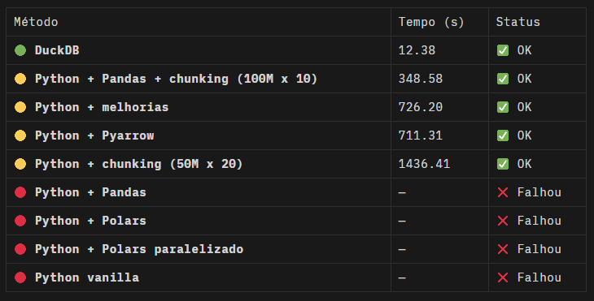
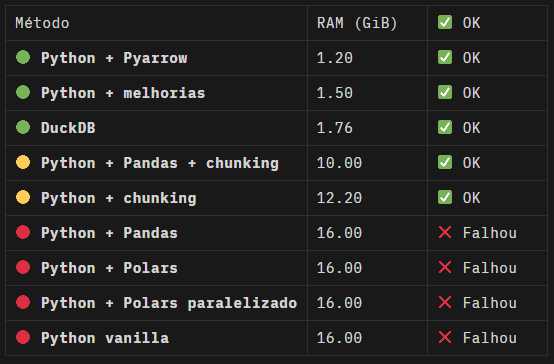
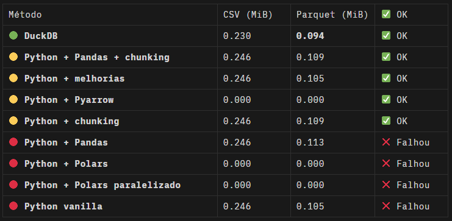
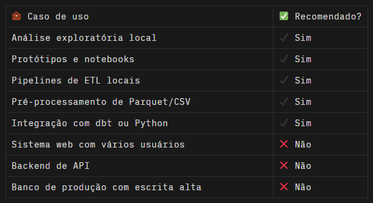

# ONE BILLION ROWS CHALLENGE - PYTHON EDITION🐍

## ABOUT THE PROJECT

✨ Uma jornada prática de engenharia de dados para processar 1 bilhão de registros, extraindo estatísticas agregadas de temperatura com performance, escalabilidade em Python, utilizando o projeto One Billion Row Challenge, desenvolvido como um exercício avançado de engenharia de dados aplicada, com o objetivo de demonstrar como processar com eficiência um arquivo massivo de 1 bilhão de linhas (~14GB) usando Python, cujo foco está em realizar operações computacionalmente simples, como agregações (mínimo, média e máximo) e ordenação com uso de recursos computacionais, de forma escalável.

Como complemento visual e analítico, o projeto inclui um dashboard interativo desenvolvido em Streamlit, com caráter de portfolio, sem utilização prática, que consome os dados processados e permite ao usuário explorar visualmente as estatísticas por estação meteorológica, cujo painel apresenta uma tabela dinâmica com os dados agregados, gráficos de barras para temperatura média, mínima e máxima, além de um gráfico de dispersão cruzando extremos térmicos, tudo isso com visualização responsiva e performance local, sem necessidade de infraestrutura em nuvem.

Este projeto é particularmente útil como estudo de caso para engenheiros de dados, cientistas de dados e desenvolvedores que desejam aprofundar seus conhecimentos em processamento de arquivos massivos, estratégias de chunking, desempenho de bibliotecas Python e uso de engines analíticas modernas como o DuckDB, e embora o One Billion Row Challenge não seja um projeto técnico, ele simula situações reais de negócio enfrentadas por empresas que lidam com grandes volumes de dados transacionais, sensoriais ou operacionais.

Todo o desafio foi executado em um ambiente local (homelab), utilizando um Dell Optiplex 7020, com sistema operacional Ubuntu Server, processador Intel Core i5-14500T e 16 GiB de memória RAM.

## INSPIRATION

O desafio foi inspirado no projeto original [1BRC](https://github.com/gunnarmorling/1brc), proposto por Gunnar Morling, em Java, posteriormente, a iniciativa foi adaptada para Python por Luciano Vasconcelos, no repositório [One-Billion-Row-Challenge-Python](https://github.com/lvgalvao/One-Billion-Row-Challenge-Python), como um workshop, dentro do contexto educacional da Jornada de Dados, em 2024.

---

## BUSINESS PROBLEM

A seguir, destacam-se os principais problemas que esse case ajuda a resolver:

🔹 Processamento de Grandes Volumes de Dados em Arquivos Brutos.

Quando empresas frequentemente recebem dados em formatos como `.csv`, `.json` ou `.parquet` contendo milhões ou bilhões de linhas, especialmente em setores como varejo, energia, climatologia, IoT e telecom, demonstrando como ler, limpar e agregar dados diretamente de arquivos massivos, sem a necessidade imediata de carregar tudo na memória ou depender de clusters caros.

🔹 Cálculo Eficiente de Estatísticas Agregadas.

Por meio da análise de dados operacionais exige cálculos como média, máximo e mínimo, que parecem simples, mas se tornam desafiadores com grande volume e múltiplas chaves, o case mostra como aplicar estratégias otimizadas de agregação, inclusive via DuckDB ou Pandas com chunking, simulando o cálculo de indicadores operacionais em escala.

🔹 Desempenho e Otimização de Recursos Computacionais.

Quando projetos de dados nem sempre rodam em ambientes robustos, muitos times enfrentam limitações de RAM, CPU e I/O, especialmente em pipelines locais, servidores intermediários ou jobs agendados, explorando estratégias de baixo consumo de memória, chunking e uso de engines colunares (como DuckDB) que permitem otimizar desempenho mesmo em máquinas comuns.

🔹 Validação de Arquiteturas Analíticas para Batch Processing.

No processo de validação, por exemplo, se uma arquitetura (ex: processamento local + exportação `.parquet`) atende aos SLAs de tempo e custo antes de mover dados para a nuvem, fornecendo um sandbox completo e replicável, permitindo testar pipelines de processamento, benchmarkar formatos de arquivo e comparar abordagens de leitura e agregação.

🔹 Treinamento e Capacitação Técnica de Times de Dados.

Para formar times com maturidade em engenharia de dados exige cases práticos e desafiadores, que vão além de notebooks pequenos ou datasets de toy, demonstrando ser um estudo de caso avançado que pode ser usado para treinar engenheiros, analistas e cientistas de dados, com foco em performance, arquitetura de dados e boas práticas de codificação.

🔹 Exportação de Dados para Consumo em BI e Visualizações.

Etapa comum a necessidade de transformar arquivos brutos em formatos eficientes para dashboards (como `.csv` limpo ou `.parquet` otimizado), gerando outputs padronizados e ordenados para ingestão por ferramentas como Power BI, Metabase, Superset ou soluções em nuvem, com foco em consumo rápido e leve.

🔹 Visualização Interativa com Dashboards Locais.

Além do processamento eficiente, o projeto oferece um dashboard interativo construído com Streamlit, que consome os dados já tratados e fornece visualizações dinâmicas, permitindo a exploração dos dados agregados por estação meteorológica. Essa visualização inclui gráficos de barras para temperaturas mínima, média e máxima, além de uma dispersão entre os extremos térmicos, tudo isso com carregamento rápido e sem necessidade de servidores externos, cuja abordagem facilita a análise exploratória local e demonstra como entregar valor analítico direto ao usuário final mesmo em ambientes de infraestrutura simples.

---

## PROPOSED CHALLENGE

O desafio proposto neste projeto consiste em desenvolver uma solução robusta, eficiente e escalável em Python capaz de processar 1 bilhão de registros de temperatura, simulando um ambiente real de engenharia de dados com alta volumetria. O foco está na extração de estatísticas agregadas por estação meteorológica, com ênfase em performance, uso consciente de recursos computacionais e entrega analítica final em múltiplos formatos, com os seguintes objetivos técnicos:

🔹 Ler com eficiência um arquivo de entrada contendo 1 bilhão de linhas, simulando medições massivas de sensores meteorológicos, mesmo em ambientes com recursos limitados.

🔹 Calcular estatísticas agregadas por estação, incluindo a Temperatura mínima registrada, Temperatura máxima registrada e Temperatura média, com precisão de 2 casas decimais

🔹 Ordenar os resultados alfabeticamente pelo nome da estação, garantindo legibilidade e estrutura analítica nos arquivos de saída.

🔹 Exportar os resultados finais em formatos amplamente utilizados `.csv` para compatibilidade com qualquer ferramenta e `.parquet` para alta performance e compressão eficiente

🔹 Comparar diferentes abordagens técnicas, avaliando o Tempo de execução, o Uso de memória RAM e o Tamanho dos arquivos gerados, tendo em norte a escalabilidade e estabilidade de cada solução.

Essas comparações cobrem soluções desde Python puro até DuckDB, passando por Pandas, chunking manual e PyArrow, evidenciando as vantagens, limitações e comportamentos esperados em pipelines analíticos de larga escala.

---

### GENERAL OPERATION

A geração do dataset sintético com 1 bilhão de linhas foi cuidadosamente projetada para simular condições realistas de ingestão massiva de dados sensoriais, adotando estratégias eficientes de escrita e controle de performance. Abaixo, o fluxo operacional detalhado:

🔹 Validação dos Argumentos de Entrada
O script principal (create_measurements.py) valida se foi passado um argumento numérico representando a quantidade de linhas desejada (ex: 1_000_000_000), garantindo flexibilidade e controle de escala.

🔹 Coleta de Nomes de Estações Meteorológicas
Os nomes são extraídos do arquivo model.csv, contendo uma lista de localidades reais. Linhas comentadas com # são ignoradas e duplicatas são automaticamente removidas, garantindo um conjunto limpo de estações válidas.

🔹 Estimativa de Tamanho do Arquivo Final
Antes de iniciar a geração, o sistema calcula uma estimativa de espaço em disco com base na quantidade de estações, na média de caracteres por linha e no formato do dado, auxiliando no planejamento de infraestrutura.

🔹 Geração Sintética de Temperaturas Aleatórias
Para cada linha, é atribuída uma temperatura float entre -99.9°C e 99.9°C, simulando leituras sensoriais, a seleção das estações segue distribuição uniforme com random.choices().

🔹 Escrita do Arquivo data/weather_stations.csv
As medições são geradas em lotes e salvas diretamente em disco no formato delimitado por ponto e vírgula (;), o nome da estação e a temperatura são armazenados por linha, mantendo consistência e portabilidade.

🔹 Processamento em Batches (100 Milhões por Lote)
A escrita é realizada em blocos de 100_000_000 registros por vez, reduzindo o impacto de I/O e melhorando drasticamente a performance de gravação, uma barra de progresso (tqdm) exibe o avanço da geração.

🔹 Monitoramento e Medição de Performance
Ao final da execução, o script exibe o tempo total decorrido e o tamanho real do arquivo gerado, validando a estimativa inicial e permitindo benchmarking do processo.

---

### OUTPUT FILE

Arquivo gerado `data/weather_stations.csv` em 6 min e 5 seg, com 14.8 GiB, somando 1 bilhão de linhas, com nome_da_estação `string` e temperatura `float` com precisão de duas casas decimais

```text
<nome_da_estação>;<temperatura>
```

Exemplo:

```text
Stockholm;-5.32
São Paulo;25.85
Cape Town;19.01
```
---

### INTERESTING TECHNICAL POINTS

Durante o desenvolvimento deste projeto, diversas boas práticas de engenharia de dados foram aplicadas, aliando performance, clareza e adaptabilidade. Desde a geração de dados até as estratégias de leitura e processamento, cada etapa foi pensada para refletir desafios reais enfrentados por engenheiros de dados em ambientes com recursos limitados.

A geração do arquivo de 1 bilhão de linhas evitou o uso do `round()` tradicional, optando por interpolação de strings `(f"{x:.1f}")` para controlar casas decimais com melhor desempenho, ainda, distribuição dos nomes das estações meteorológicas foi feita com `random.choices()` para simular uniformidade geográfica realista, a escrita dos dados foi realizada em blocos (batch write), reduzindo drasticamente o tempo de I/O, uma otimização essencial quando se trabalha com arquivos massivos.

Antes mesmo da geração dos dados, o script realiza uma estimativa precisa do tamanho esperado em disco, auxiliando no planejamento de infraestrutura. Ao longo da execução, mensagens informativas e uma barra de progresso mantêm o usuário bem informado, com validações robustas e opções de ajuda acessíveis por linha de comando.

Na etapa de processamento, diferentes abordagens foram implementadas para comparar desempenho, escalabilidade e consumo de memória, desde leitura linha a linha com agregações em tempo real em dicionários (ideal para máquinas com pouca RAM), até chunking manual e com Pandas, permitindo maior controle e performance em pipelines iterativos.

Também foi incluído o uso do DuckDB, uma engine colunar embutida que executa consultas SQL diretamente sobre arquivos `.csv` e `.parquet`, entregando performance próxima de sistemas distribuídos, mas sem a complexidade de um cluster.

Essa combinação de técnicas oferece um estudo de caso valioso para quem busca aprender ou ensinar práticas reais de engenharia de dados com foco em desempenho, boas escolhas arquiteturais e domínio técnico sobre o stack Python moderno.

---

## HOW TO RUN

### REQUIREMENTS

1. Git e Github: Utilizado para versionamento do código e para repositório remoto do projeto.
Você deve ter o Git instalado em sua máquina e também deve ter uma conta no GitHub.
[Instruções de instalação do Git aqui](https://git-scm.com/doc).
[Instruções de instalação do Github aqui](https://docs.github.com/pt).

2. Pyenv: É usado para gerenciar versões do Python em ambientes virtuais, fundamental para isolar a aplicação e evitar problemas de conflitos entre versões de bibliotecas e do próprio Python.
[Instruções de instalação do Pyenv aqui](https://github.com/pyenv/pyenv#installation).
Neste projeto, vamos utilizar o Python 3.11.4

3. Poetry: Este projeto utiliza Poetry para gerenciamento de dependências.
[Instruções de instalação do Poetry aqui](https://python-poetry.org/docs/#installation).

---

### INSTALAÇÃO E CONFIGURAÇÃO

A - No diretório raiz, execute o comando, passando os argumentos da quantidade de linhas que quer gerar:

```python
python create_measurements.py 1_000_000_000
```
---

B - Confirmar a quantidade de linhas e o formato do arquivo gerado:
```python
wc -l ../data/weather_stations.csv
head -n 5 ../data/weather_stations.csv
```

C - Acesse o diretório `src` e execute os comandos abaixo, de acordo com a ferramenta e amodelagem de dados desejada:

1) Python - processamento BRUTO, utilizando `defaultdict`, Python vanilla!
```python
python etl_python.py
```

2) Python com chuncking
```python
python etl_python_chuncking.py
```

3) Instale a biblioteca Pyarrow, utilizando o Poetry, com o comando:
```python
poetry add pyarrow
```

4) Python com Pyarrow
```python
python etl_python_pyarrow.py
```

5) Instale a biblioteca Pandas, utilizando o Poetry, com o comando:
```python
poetry add pandas
```

6) Pandas
```python
python etl_pandas.py
```

7) Pandas com chuncking
```python
python etl_pandas_chuncking.py
```

8) Instale a biblioteca Polars, utilizando o Poetry, com o comando:
```python
poetry add polars
```

9) Polars
```python
python etl_polars.py
```

10)  Instale a biblioteca DuckDB, utilizando o Poetry, com o comando:
```python
poetry add duckdb
```

11)  DuckDB
```python
python etl_duckdb.py
```
### LOGGING

Todos os processamentos estão sendo gravados no diretório `logs`com seu respectivo nome do arquivo.

---

## OUTPUT EXAMPLES

Todos os resultados finais são exportados nos formatos `.csv` e `.parquet` .

Isso permite análises posteriores em ferramentas como Power BI, Metabase, Apache Superset ou puro Python, inclusive, o arquivo de saída será ordenado alfabeticamente por nome da estação:

```python
| Estação    |   Min  | Média |  Max  |
| ---------- | ------ | ----- | ----- |
| Aabenraa   | -99.80 | 3.4   | 99.80 |
| Bariloche  | -57.40 | 8.2   | 87.30 |
| Copenhagen | -45.50 | 11.9  | 94.10 |
```

---

## BENCHMARKING AND PERFORMANCE RESULTS ✨

### PYTHON
🔴 Python vanilla, sem utilização de ulimit ou cgroups, a ETL quebrou por 6 vezes, consumindo os 16 GiB (15.3) de memória RAM do servidor e mais 4 de Swp.

🟨 Python Vanilla com melhorias de performance, a ETL rodou satisfatoriamente, demorando 726.20 segundos (pouco mais de 12 minutos) e consumindo apenas 1.5 GiB de memória RAM, no momento de pico de utilização do sistema.

🟨 Python com a utilização de técnica de chunking, a ETL rodou sofrida, não aguentou com chuncking de 100 milhões de linhas, quebrando duas vezes, rodando com chuncking de 50 milhões de linhas em 20 etapas, demorando 1436.41 segundos (quase 24 minutos) e consumindo 12.2 GiB de memória RAM, no momento de pico de utilização do sistema.

---

### PYTHON + PYARROW
🟨 Python com a utilização da biblioteca pyarrow apenas para gravar o parquet, a ETL rodou satisfatoriamente, demorando 711.31 segundos (quase 12 minutos) e consumindo apenas 1.2 GiB de memória RAM, no momento de pico de utilização do sistema.

---

### PYTHON + PANDAS
🔴 Python + Pandas na leitura e no processamento, a ETL quebrou por 3 vezes, consumindo os 16 GiB (15.3) de memória RAM do servidor e mais 4 de Swp.

🟨 Python + Pandas na leitura e no processamento + utilização de técnica de chunking, a ETL rodou satisfatoriamente, rodou com chuncking de 100 milhões de linhas, demorando 348.58 segundos (quase 6 minutos) e consumindo 10 GiB de memória RAM, no momento de pico de utilização do sistema.

---

### PYTHON + POLARS
🔴 Python + Polars na leitura e no processamento, a ETL quebrou por 3 vezes, em 5 segundos, consumindo os 16 GiB (15.3) de memória RAM do servidor e mais 4 de Swp.

🔴 Python + Polars na leitura e no processamento + utilização de técnica de paralelismo, a ETL quebrou por 3 vezes, em 5 segundos, consumindo os 16 GiB (15.3) de memória RAM do servidor e mais 4 de Swp.

---

### DuckDB 🥇 🏆
🟢 Utilização do banco de dados DuckDB, a ETL rodou lisa, demorando 12.38 segundos e consumindo apenas 1.76 GiB de memória RAM, no momento de pico de utilização do sistema.

Durante o desenvolvimento do desafio, foi instalado recurso Early Out-Of-Memory killer, que monitora a memória do sistema e mata processos automaticamente antes que o sistema fique totalmente sem memória (e congele), previnindo travamentos causados por falta de RAM, especialmente útil em sistemas com pouca memória, como homelabs.

## CONCLUSION

O benchmark conduzido com 1 bilhão de registros sintéticos de estações meteorológicas revela insights importantes sobre tempo de execução, uso de memória, tamanho dos arquivos e escalabilidade entre diferentes estratégias de processamento: Python puro, Pandas, abordagens com chunking, Polars e DuckDB.

### 1. Tempo de Execução Total

- DuckDB manteve seu desempenho superior, concluindo a ETL em apenas 12.38 segundos, mesmo com 1 bilhão de linhas.
- Pandas com chunking foi a abordagem tradicional mais eficiente, concluindo em 348.58 segundos (~6 minutos).
- Python puro com melhorias levou 726.20 segundos (~12 minutos), com performance estável.
- Python com chunking precisou de múltiplas etapas (20 chunks de 50 milhões), totalizando 1436.41 segundos (~24 minutos).
- As abordagens com Polars e Pandas sem chunking falharam devido ao estouro de memória, não completando a execução.



---

### 2. Pico de Uso de Memória RAM

- Python + PyArrow (escrevendo apenas Parquet com PyArrow) foi o mais econômico, com pico de 1.2 GiB.
- DuckDB também se manteve enxuto, consumindo apenas 1.76 GiB.
- Python + melhorias estabilizou em 1.5 GiB.
- Pandas com chunking usou 10 GiB, demonstrando bom controle.
- Python com chunking chegou a 12.2 GiB.
- Pandas, Polars e outras abordagens sem chunking estouraram os 16 GiB de RAM + 4 GiB de swap, travando a execução.



---

### 3. Tamanho dos Arquivos (MiB)

Todos os arquivos CSV têm tamanho semelhante (~252 KB), o DuckDB gerou o menor `.csv` e também o `.parquet` mais compacto, evidenciando compressão eficiente e escrita otimizada.



---

### Considerações de Arquitetura e Escalabilidade

- DuckDB permanece como a opção mais rápida, leve e escalável para análise local, com excelente performance mesmo com 1 bilhão de registros.
- Pandas + chunking se mostra um bom compromisso para ambientes com restrição de memória, sem comprometer robustez.
- Python puro com chunking é funcional, mas requer ajustes e monitoramento rigoroso de recursos.
- Polars ainda não sustentou o volume testado, falhou em todas as tentativas mesmo com paralelismo ativado.

### Recomendações Finais

Para pipelines de grande volume com baixa complexidade de transformação e foco em performance:

- ✅ DuckDB continua imbatível: rápido, econômico e com boa compressão.
- 🟡 Pandas com chunking é seguro, compatível e fácil de manter.
- 🟡 Python com chunking é defensável, mas exige mais trabalho manual.
- 🔴 Abordagens sem chunking não são recomendadas acima de 1 bilhão de linhas.
- ➡️ DuckDB é a escolha mais enxuta, tanto em CSV quanto em Parquet.
- ➡️ Parquet é amplamente superior ao CSV em termos de eficiência de armazenamento e preparo para análise.

---

## Funcionalidades do Dashboard

Dashboard interativo em Streamlit exibe e explora estatísticas climáticas agregadas por estação meteorológica e as principais funcionalidades incluem:

### Leitura e Visualização de Dados

- Leitura otimizada de arquivo `.csv` com separador `;`.
- Verificação automática da existência do arquivo de dados.
- Exibição interativa da tabela completa com estatísticas por estação.
- Feedback visual de sucesso ou erro no carregamento dos dados.


### Visualizações Gráficas Interativas

1.  Temperatura Média por Estação, com gráfico de barras com valores médios por estação.
2.  Temperatura Mínima por Estação, por meio de gráfico de barras colorido com escala azul para destacar variações de mínimas.
3.  Temperatura Máxima por Estação, utilizando gráfico de barras com coloração em tons de vermelho para destacar extremos.
4.  E dispersão de Mínima vs Máxima, com gráfico de dispersão (scatter plot) com cada ponto representando uma estação.
    - Eixo X: Temperatura mínima
    - Eixo Y: Temperatura máxima
    - Tamanho dos pontos baseado na temperatura média (normalizada)

### Como rodar o dashboard

O repositório contempla o arquivo `src/create_station_metrics_mart.py` que gera um arquivo intermediário `data/station_metrics_mart.csv` , transformado e preparado para consumo do dashboard que pode ser executado, por meio dos comandos:

1) Instale a biblioteca Streamlit, utilizando o Poetry, com o comando:
```python
poetry add streamlit
```

2) no diretório `dashboard`, execute o Streamlit:
```python
poetry run streamlit run dashboard/app_duckdb_csv_table.py
```
3) Acesse a url fornecida pela aplicação.

---

## ✨ 🦆 O DuckDB é tão excepcional que merece uma explicação um pouco mais detalhada


### DuckDB: rápido, leve e pronto para escalar localmente

DuckDB é uma excelente fonte para dashboards, se usado da maneira certa, o motor mais equilibrado para análises locais e pipelines de pequeno e médio porte, por que funciona tão bem?

- Ele processa os dados direto do disco, sem precisar carregá-los inteiramente na memória.
- Seu modelo de execução é colunar e vetorizado, o que significa que cada operação trabalha por blocos otimizados, aproveitando o cache do processador.
- Funciona bem mesmo com apenas um núcleo (monothread), o que o torna ideal para ambientes simples, como notebooks ou servidores de uso geral.
- Leitura muito rápida:
- Consultas analíticas (`SELECT`, `GROUP BY`, `JOIN`) são extremamente otimizadas em DuckDB, principalmente em formatos como Parquet e CSV.
- Ideal para painéis que consultam dados prontos, agregados.
- Compatível com ODBC/ODBC-like connectors:
- DuckDB oferece conectores (em evolução) para se integrar com BI tools, especialmente via drivers ODBC.
- Já existem métodos para conectar o Power BI via ODBC e o Metabase via JDBC/ODBC (com algum esforço).
- Formato leve e portátil:
- O `.DuckDB` é um único arquivo. Você pode gerar e compartilhar com o dashboard, sem precisar de um servidor de banco.
- Integração com Parquet e CSV:
- DuckDB pode ser usado para consultar diretamente arquivos Parquet/CSV como se fossem tabelas, útil quando seu dashboard é alimentado por arquivos externos.

✅ Ideal para protótipos rápidos e ETLs locais com performance real, ambientes com pouca RAM ou CPU.

---

############################### MAS CUIDADO ⛔ ###############################

---

O DuckDB é uma ferramenta poderosa, mas como toda tecnologia, tem um conjunto de casos para os quais é ideal e outros onde não é a melhor escolha, conforme segue:

### ⚠️ DuckDB é excelente para prototipagem, análise local, cargas moderadas e dados tabulares em formato Parquet, CSV, Arrow, mas por que DuckDB não é geralmente indicado para produção?

Nem todo projeto de dados exige alta performance ou infraestrutura distribuída, mas saber escolher a abordagem certa para o contexto certo é o que separa scripts rápidos de pipelines confiáveis e sustentáveis, seus testes mostraram que cada tecnologia se comporta de forma distinta frente a três fatores críticos: volume de dados, disponibilidade de memória RAM e necessidade de escalabilidade.

#### 1. Arquitetura embutida, não cliente-servidor

- DuckDB roda embutido no processo da aplicação (embedded database), isso quer dizer que não há um servidor separado para lidar com concorrência, autenticação, escalabilidade, etc., em produção, espera-se que o banco aceite múltiplas conexões, distribua carga e possa ser escalado horizontalmente.

👉 Consequência: DuckDB é monousuário por design, se múltiplas aplicações ou usuários tentarem acessar o mesmo banco simultaneamente, você corre risco de corrupção ou race conditions.

---

#### 2. Não suporta múltiplas sessões concorrentes de escrita

- Em bancos como PostgreSQL, múltiplos processos podem ler e escrever simultaneamente, com controle de transações.
- O DuckDB só permite uma escrita por vez e ainda bloqueia arquivos `.DuckDB` durante a operação.

👉 Consequência: Impraticável em ambientes multiusuário, com alta taxa de gravação ou uso concorrente, como APIs, microsserviços e sistemas OLTP.

---

#### 3. Não é tolerante a falhas por padrão

- Bancos de produção geralmente contam com replicação, backups automáticos, failover, logs de transação para recovery e DuckDB não implementa esses recursos nativamente.

👉 Consequência: Se seu processo for interrompido abruptamente (por crash, falha de disco ou interrupção de energia), você pode perder o banco ou corromper o arquivo.

---

#### 4. Não escala horizontalmente

- DuckDB não possui arquitetura distribuída, ele não foi feito para escalar em múltiplas máquinas nem processar grandes volumes em cluster (como Spark, Dask, BigQuery, etc).

👉 Consequência: Para dados de alta volumetria (> bilhões de linhas), ou para times que precisam escalar a leitura e escrita em paralelo, o DuckDB não acompanha.

---

#### 5. Foco principal é análise local — OLAP, não OLTP

- DuckDB é orientado a consultas analíticas complexas (OLAP), não a sistemas transacionais (OLTP), ele brilha ao fazer `SELECT station, AVG(temp)` em 100 milhões de linha, mas não serve bem para registrar pedidos de e-commerce ou gerenciar usuários de um app em tempo real.

👉 Consequência: Não use DuckDB para aplicações com alta taxa de inserção, atualização ou leitura em tempo real.

---

### Use DuckDB com confiança para:



Quando se trata de uso do DuckDB como fonte de dados para dashboards, como Power BI, Metabase, Superset ou até Streamlit, a análise muda bastante, e a resposta é "depende do uso, mas com ressalvas importantes".

---

### Recomendações práticas


DuckDB é extremamente eficaz para gerar datasets analíticos e alimentadores de dashboard, mas não é ideal como fonte de dados dinâmica e concorrente.

- Use DuckDB para processar e entregar dados prontos para visualização.
- Evite usá-lo como backend direto em dashboards multiusuário em produção.
- Melhor estratégia: DuckDB → Parquet → Dashboard.

---

## MAIN TECHNICAL FEATURES

✅ Processamento de 1 bilhão de registros (~14GB) com múltiplas abordagens: Python puro, Pandas, chunking manual, PyArrow, Polars e DuckDB.

✅ Benchmark completo avaliando tempo de execução, uso de memória e tamanho de arquivos de saída (`.csv` e `.parquet`).

✅ Geração realista de dados sintéticos, com distribuição uniforme entre estações meteorológicas e variação controlada de temperatura.

✅ Chunking com controle de memória, permitindo processar arquivos massivos sem sobrecarregar a RAM.

✅ Uso avançado do DuckDB, engine analítica colunar SQL-in-process, com leitura direta do disco e escrita compacta.

✅ Visualização e storytelling analítico com gráficos comparativos de tempo, memória e espaço.

✅ Script modular em Python, com logging, organização em camadas (src/, data/, logs/) e suporte a múltiplos formatos.

✅ Ambiente isolado com Pyenv e Poetry, garantindo reprodutibilidade e controle de dependências.

✅ Padrões de codificação e segurança com pre-commit hooks, linting (ruff, black) e auditoria de dependências (pip-audit).

✅ Foco educacional e de portfólio, com documentação detalhada, orientada à performance, arquitetura e boas práticas.

---

## TECHNOLOGIES USED

### 🛠️ Project Stack Challenge Overview


### Tecnologias Utilizadas no Dashboard

- Streamlit: Framework web para dashboards em Python.
- Plotly Express: Gráficos interativos com visual moderno.
- Pandas: Leitura e manipulação de dados tabulares.
- Pathlib: Manipulação segura de caminhos de arquivos.
---

## QUESTIONS, SUGGESTIONS OR FEEDBACK

🚀 André Matiello C. Caramanti - [matiello.andre@hotmail.com](mailto:matiello.andre@hotmail.com)

Project carried out with the support of Artificial Intelligence (ChatGPT)

---

## LICENSE

[MIT License](https://andrematiello.notion.site/mit-license)
